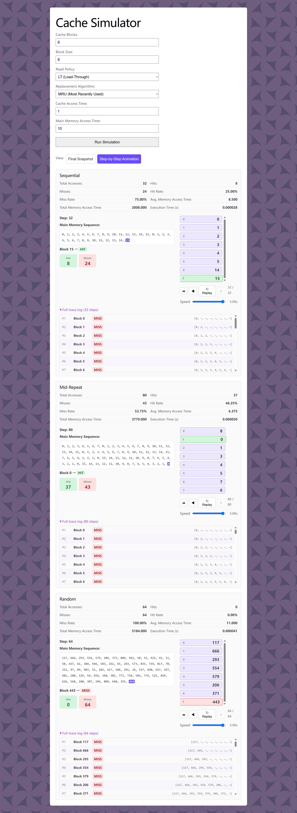
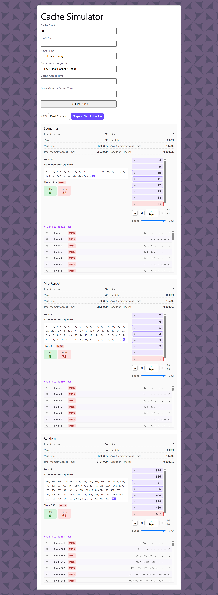
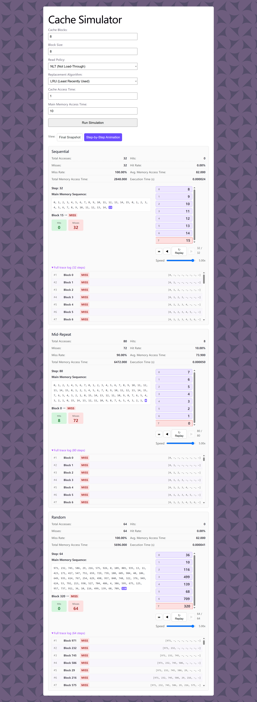
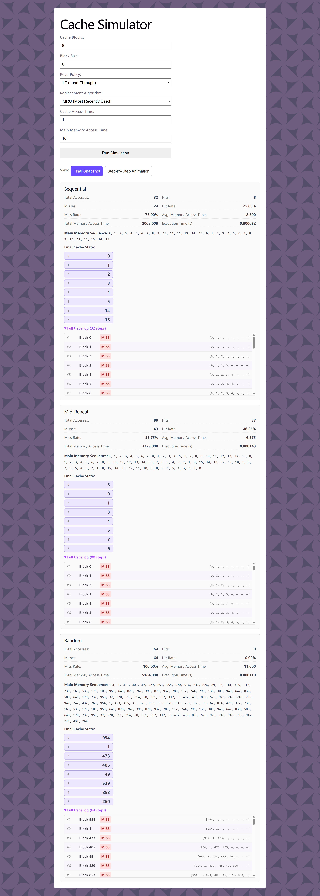
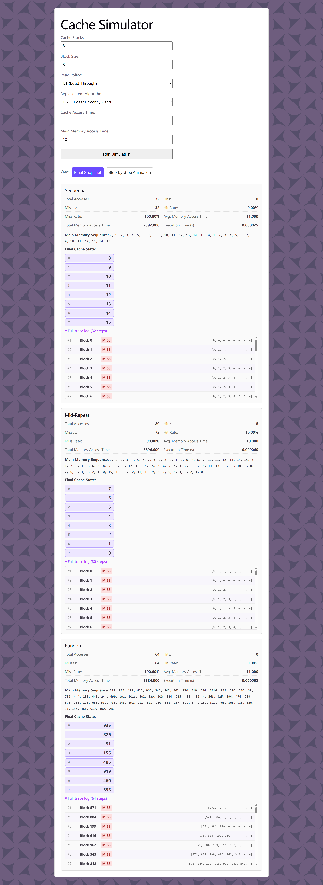

# Cache Simulator

## Structure

```
├── src/App.jsx          the whole website (form + results)
├── src/main.jsx         loads App.jsx into the page
├── api/index.py         the server — cache simulation logic + Flask API that runs it, all in one file
├── index.html            the page that loads App.jsx
└── vercel.json           tells Vercel to route /api/* requests to api/index.py
```

The website (`src/`) and the server (`api/`) are two separate programs that talk to each other over the internet — the website sends the form numbers to `/api/simulate`, the server runs the simulation and sends the results back.

## Run locally

Open two terminals.

**Terminal 1 — backend**
```bash
cd api
pip install flask flask-cors
python index.py
```

**Terminal 2 — frontend**
```bash
npm install
npm run dev
```

Then open the URL it prints (usually `http://localhost:5173`).

Both terminals need to stay open while you're using it.

## Parameters & Outputs
| Parameter | Type | Specification |
|---|---|---|
| Cache Mapping Function | Fixed | Fully Associative |
| Main Memory Size | Fixed | 1024 blocks |
| Cache Blocks | Parameterized | Minimum 4 blocks; power of 2 |
| Block Size | Parameterized | Minimum 2 words; power of 2 |
| Read Policy | Parameterized | Load-through or Non-load-through |
| Replacement Algorithm | Parameterized | Least Recently Used (LRU) or Most Recently Used (MRU) |
| Cache Access Time | Parameterized | Greater than 0 |
| Main Memory Access Time | Parameterized | Greater than 0 |

output table...

## Test Cases (Let n be the total number of cache blocks)

**Load-Through**: On a cache miss, the data is sent directly to both the cache and the processor at the same time. The processor does not wait for an extra cycle after the cache is updated. This results in shorter miss penalty and faster access time.

**Non-Load-Through**: On a cache miss, the block is first loaded into cache, and only then sent to the processor. This adds extra delay on every cache miss.

**Comparison**: Load-Through is always faster or equal to Non-Load-Through. The advantage of Load-Through in reducing access time will be very evident when there are a significant number of misses.

### Sequential Sequence
Access Order: 0 to 2n-1 repeated twice

Example: n=4 (0,1,2,3,4,5,6,7,0,1,2,3,4,5,6,7)

First Half First Pass: 0,1,2,3

Second Half First Pass: 4,5,6,7

First Half Second Pass: 0,1,2,3

Second Half Second Pass: 4,5,6,7

**LRU**: The cache fills from top to bottom during the first half of the first pass until it becomes full (Cache: 0,1,2,3). As the second half of the first pass is accessed, those new blocks replace the whole first-half blocks from top to bottom (Cache: 4,5,6,7). When the second pass begins, the first-half blocks are no longer in the cache, so they all miss and replace the second-half blocks of the first pass (Cache: 0,1,2,3). Similarly, when the second half of the second pass is accessed, the second-half blocks of the first pass have already been evicted by the first-half blocks of the second pass (Cache: 4,5,6,7). As a result, every access is a cache miss, giving an overall 0% hit rate.

**MRU**: The cache fills from top to bottom during the first half of the first pass until it becomes full (Cache: 0,1,2,3). As the second half of the first pass is accessed, the most recently used block, which is the last position, will be continuously modified until the end of the second half first pass (Cache: 0,1,2,7). When the second pass first half begins, the blocks except for the last block in the first half will hit. Since it's most recently used, the second to the last position will be replaced by the last block in first half second pass (Cache: 0,1,3,7). When the second half of the second pass is accessed, the most recently used is still the second to the last position. This position will be continuously modified until the last block of the second half hit the last block (Cache: 0,1,6,7). This results in a higher hit rate than LRU.

### Mid-Repeat Blocks
Access Order: 0 to n-1, 0 to 2n-1 (x2) -> reversed full sequence

Example: n = 4 (0,1,2,3,0,1,2,3,4,5,6,7,0,1,2,3,4,5,6,7,3,2,1,0,7,6,5,4,3,2,1,0,7,6,5,4,3,2,1,0)

Part 1: 0,1,2,3

Part 2: 0,1,2,3

Part 3: 4,5,6,7

Part 4: 0,1,2,3

Part 5: 4,5,6,7

Part 6: 3,2,1,0

Part 7: 7,6,5,4

Part 8: 3,2,1,0

Part 9: 7,6,5,4

Part 10: 3,2,1,0

**LRU**: The cache fills from top to bottom during part 1. For part 2, all 4 blocks will hit because it is exactly the same as part 1. Aside from this, all the other parts will miss and the final cache state will be exactly the same as part 10.

**MRU**: The cache fills from top to bottom during part 1. For part 2, all 4 blocks will hit because it is exactly the same as part 1. When part 3 is accessed, it will miss and continously replace the last block (Cache: 0,1,2,7). For part 4, all blocks will hit except for the last block since it is already replaced by part 3. Since this is most recently used, the second to the last block will be replaced by the last block in part 4 (Cache: 0,1,3,7). For part 5, it will continuously modify the second to the last block until the last block of part 5 matches the last block in cache (Cache: 0,1,6,7). For part 6, the last block will be continously replaced by the first 2 blocks until the others will hit (Cache: 0,1,6,2). The most recently used block currently is now the first cache block. For part 7, only the second block will hit. However, it will be replaced by the blocks after it (Cache: 7,1,4,2). For part 8, only two blocks will hit (Cache: 7,0,3,2). For part 9, only one block will hit (Cache: 4,0,3,2). Lastly, the 3 blocks will hit (Cache: 4,0,3,1). This clearly indicates higher hit rate compared to LRU, since LRU only hits in the first 2 parts.

### Random Sequence
Access Order: Random sequences of 64 block accesses (0 to 1023 range)

**LRU vs MRU**: The cache wil fill as unique blocks are encountered. When the cache is full, every new block that is currently not in the cache will evict either the most recently used block or the least recently used block. Since the sequence is random, there is no predictable pattern and the hit rate depends entirely by chance. Neither policy shows a clear advantage over the other.

## Simulation Screenshots

### Step-by-Step Animation Views (LT MRU, NLT MRU, LT LRU, NLT LRU)





### Final Snapshot Views (LT MRU, NLT MRU, LT LRU, NLT LRU)





### Different Timing Values (Cache Access Time & Memory Access Time)
-Animation.png)
-Snapshot.png)

### Edge Cases (Minimum Values)
-Animation.png)
-Snapshot.png)

